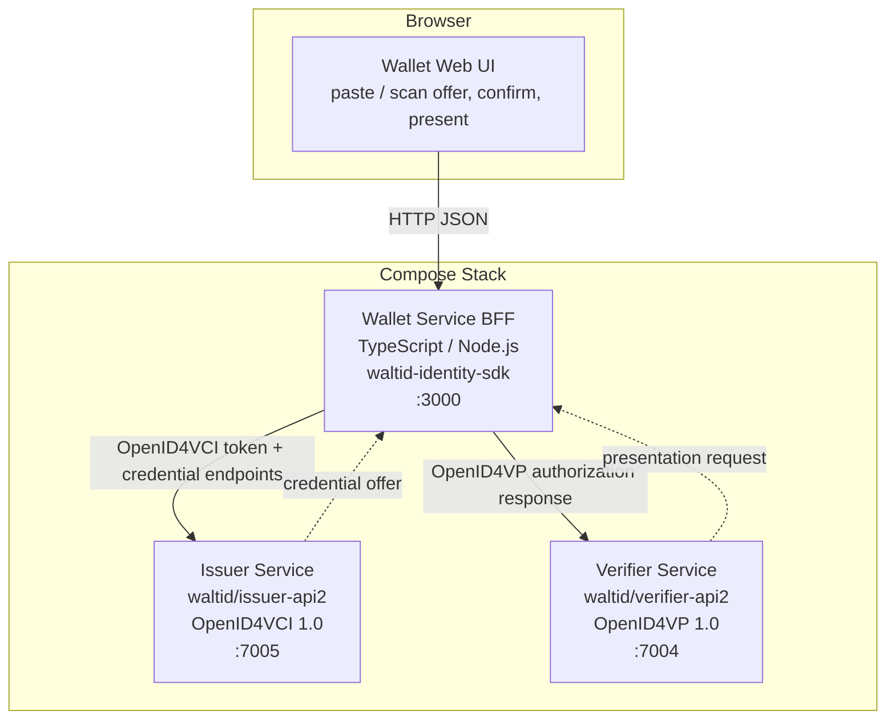
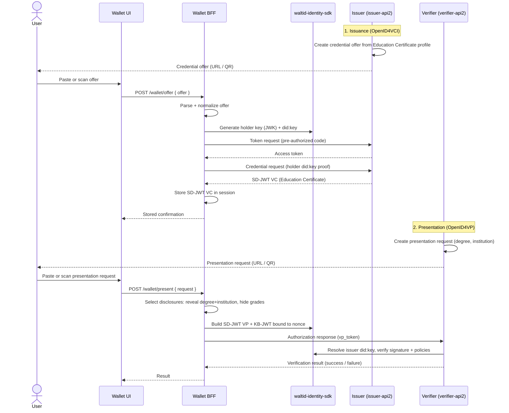
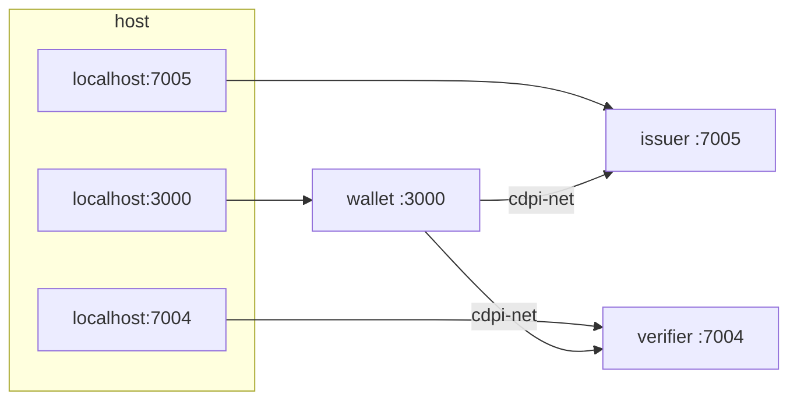

# Design Document

## Overview

This design describes a lean, end-to-end Verifiable Credential demonstration built on the walt.id Open-Source Identity Stack. The system issues an Education Certificate as an SD-JWT VC over OpenID4VCI, accepts and holds it in a minimal web wallet, presents it with selective disclosure over OpenID4VP (revealing `degree` and `institution`, withholding `grades`), and verifies the presentation.

The architecture is intentionally thin. Issuance and verification are delegated to pre-built, standards-compliant walt.id microservices consumed purely over REST. The only bespoke service is the **Wallet** — a TypeScript/Node.js backend-for-frontend (BFF) plus a minimal web UI that acts as the Holder, driving the OpenID4VCI and OpenID4VP exchanges and performing key/DID handling through the `waltid-identity-sdk`.

The entire stack is launched with a single `docker compose up`. A happy-path integration test drives the full issue → store → present → verify flow, and a minimal GitHub Actions pipeline enforces lint plus a Compose build on pull requests.

> **Stack note.** The requirements and ADR name the walt.id microservices `waltid-issuer-api` and `waltid-verifier-api`. walt.id's current community stack ships these as **Issuer2** (`waltid/issuer-api2`, port `7005`) and **Verifier2** (`waltid/verifier-api2`, port `7004`), which implement the **finalized OID4VCI 1.0 and OID4VP 1.0** specifications rather than the deprecated draft versions in the original v1 services. This design targets the v2 services to meet the finalized-spec compliance goal; the original v1 services (`waltid/issuer-api`:`7002`, `waltid/verifier-api`:`7003`) remain drop-in alternatives if draft-spec behavior is required. References: [walt.id Community Stack home](https://docs.walt.id/community-stack/home), [Issuer2 getting started](https://docs.walt.id/community-stack/issuer2/getting-started), [Verifier2 getting started](https://docs.walt.id/community-stack/verifier2/getting-started). Content was rephrased for compliance with licensing restrictions.

## Architecture

### High-Level Topology

Three services orchestrated by Docker Compose on a shared bridge network. The Wallet BFF is the only component that talks to both walt.id services; the browser talks only to the Wallet BFF.



### Role Mapping

| Role | Service | Implementation | Protocol surface |
| :--- | :--- | :--- | :--- |
| Issuer | `services/issuer` | Pre-built `waltid/issuer-api2` + config/profile | OpenID4VCI 1.0 (REST) |
| Holder / Wallet | `services/wallet` | Custom TS/Node BFF + web UI, `waltid-identity-sdk` | OpenID4VCI client + OpenID4VP client |
| Verifier | `services/verifier` | Pre-built `waltid/verifier-api2` + config/policy | OpenID4VP 1.0 (REST) |

### Why This Split

The issuer and verifier are consumed as opaque, version-pinned containers because the ADR's rationale is to minimize custom protocol/crypto work and rely on vetted walt.id implementations. The wallet is custom because the demo needs a Holder with a visible UI, session-scoped credential storage, and explicit selective-disclosure control — behavior not provided turnkey by the issuer/verifier APIs. Key generation and `did:key` handling in the wallet use the `waltid-identity-sdk` so the Holder binding and the verifier's `did:key` resolution share the same primitives.

## End-to-End Flow



### Flow Stages

1. **Issuance.** The issuer exposes an Education Certificate credential profile. An offer is created (via the issuer's offer-creation endpoint) and surfaced to the user as a URL/QR. The wallet BFF parses the offer, generates a holder key and `did:key` through the SDK, performs the OpenID4VCI pre-authorized code exchange (token request → credential request with holder proof), and receives an SD-JWT VC.
2. **Storage.** The BFF stores the raw SD-JWT VC string in server-side session state and returns a confirmation the UI renders.
3. **Presentation.** The verifier creates an OpenID4VP presentation request naming `degree` and `institution`. The user hands the request to the wallet. The BFF selects disclosures (keep `degree`, `institution`; drop `grades`), assembles an SD-JWT VP with a key-binding JWT bound to the request `nonce`, and posts the authorization response (`vp_token`) to the verifier.
4. **Verification.** The verifier resolves the issuer `did:key`, validates the issuer signature and holder key binding, checks the configured policies, confirms the disclosed attributes, and returns a success/failure result.

## Components and Responsibilities

### Issuer Service (`services/issuer`)

- **Nature:** Pre-built `waltid/issuer-api2` container, version-pinned, consumed over REST only. Not modified.
- **Configuration:** A mounted config directory defines an **Education Certificate** credential profile — credential type/`vct`, the SD-JWT VC format, the issuer signing key (an SDK-generated `did:key`), the claim template (holder name, degree, institution, grades), and which claims are selectively disclosable.
- **Responsibilities:** Create OpenID4VCI credential offers from the profile; serve issuer metadata; run the token and credential endpoints; sign and return the Education Certificate as an SD-JWT VC.
- **Reference:** [Issuer2 SD-JWT VC issuance & profiles](https://docs.walt.id/community-stack/issuer2/getting-started), [Issuer2 setup](https://docs.walt.id/community-stack/issuer2/setup).

### Verifier Service (`services/verifier`)

- **Nature:** Pre-built `waltid/verifier-api2` container, version-pinned, consumed over REST only. Not modified.
- **Configuration:** A mounted config directory defines the **presentation definition / policy** that requests `degree` and `institution` from an Education Certificate and the trust/validation policies (issuer signature, holder binding, SD-JWT disclosure integrity).
- **Responsibilities:** Create OpenID4VP presentation requests; receive the `vp_token`; resolve the issuer `did:key`; validate signatures, holder key binding, challenge binding, and disclosed claims; return a structured verification result.
- **Reference:** [Verifier2 SD-JWT VC via OID4VP](https://docs.walt.id/community-stack/verifier2/getting-started), [Verifier2 setup](https://docs.walt.id/community-stack/verifier2/setup).

### Wallet Service (`services/wallet`) — custom

A TypeScript/Node.js service with two layers.

**Web UI (thin):**
- Offer intake by **paste** (textarea) or **scan** (QR via camera/image → decoded string).
- "Accept offer" action and a stored-credential confirmation panel.
- Presentation-request intake (paste/scan) and a "Present" action.
- Verification result display.

**Backend-for-frontend (BFF):** holds all protocol logic and secrets; the browser never touches walt.id directly.

| Module | Responsibility |
| :--- | :--- |
| `offerIntake` | Normalize pasted/scanned input into a canonical offer object; reject malformed input with an invalid-offer error. |
| `oid4vciClient` | Drive the OpenID4VCI pre-authorized code flow against the issuer: token request, credential request with holder proof, parse SD-JWT VC. |
| `holderKeys` | Use `waltid-identity-sdk` to generate the holder JWK and `did:key`, and produce the key-binding proof. |
| `sessionStore` | In-memory, session-scoped storage of the raw SD-JWT VC (keyed by session id). No persistence beyond the session. |
| `disclosureSelector` | Given a stored SD-JWT VC and a presentation request, select the disclosures to reveal (degree, institution) and drop the rest (grades). |
| `oid4vpClient` | Build the SD-JWT VP + KB-JWT bound to the request `nonce`, and post the authorization response to the verifier. |
| `httpApi` | REST surface consumed by the UI (see below). |

**Wallet BFF HTTP API (internal, UI-facing):**

| Method & path | Purpose |
| :--- | :--- |
| `POST /wallet/offer` | Accept an offer string, run OpenID4VCI, store the credential, return confirmation. |
| `GET /wallet/credential` | Return a redacted summary of the stored credential for the confirmation panel. |
| `POST /wallet/present` | Accept a presentation-request string, apply selective disclosure, submit `vp_token`, return the verifier result. |
| `GET /healthz` | Liveness for Compose health checks. |

### REST Interaction Summary

- **Wallet → Issuer:** OpenID4VCI token endpoint and credential endpoint (pre-authorized code flow). Issuer base URL injected via `ISSUER_BASE_URL` (`http://issuer:7005` on the Compose network).
- **Wallet → Verifier:** OpenID4VP authorization response submission carrying the `vp_token`. Verifier base URL via `VERIFIER_BASE_URL` (`http://verifier:7004`). Presentation-request creation is triggered out of band (verifier endpoint / UI) and the request string is handed to the wallet, mirroring a real cross-device flow.

## Data Model

### Education Certificate (SD-JWT VC)

The credential type carries exactly four subject attributes. All four are present at issuance; `degree` and `institution` are revealed at presentation and `grades` is withheld.

| Attribute | Field (claim) | Type | Disclosable | Revealed in demo presentation |
| :--- | :--- | :--- | :--- | :--- |
| Holder name | `name` | string | yes | no (not requested) |
| Degree | `degree` | string | yes | **yes** |
| Institution | `institution` | string | yes | **yes** |
| Grades | `grades` | string / array | yes | **no (withheld)** |

**Representative claim set (conceptual):**

```jsonc
{
  "vct": "EducationCertificate",
  "iss": "did:key:z6Mk...",      // issuer did:key, resolvable via waltid-identity-sdk
  "cnf": { "jwk": { /* holder public JWK */ } },  // holder key binding
  "name": "Ada Lovelace",
  "degree": "BSc Computer Science",
  "institution": "University of Example",
  "grades": "First Class Honours"   // selectively disclosable; withheld at presentation
}
```

In SD-JWT VC form the disclosable claims are represented as salted digests (`_sd`) with separate disclosure strings; a presentation includes only the disclosures the holder chooses to reveal.

### Internal Wallet Types (structured)

```typescript
// Canonical, parser-agnostic offer after normalizing paste/scan input.
interface CredentialOffer {
  issuer: string;              // issuer base URL / credential_issuer
  preAuthorizedCode: string;   // pre-authorized_code grant value
  credentialConfigurationIds: string[];
  raw: string;                 // original offer string
}

// Server-side, session-scoped stored credential.
interface StoredCredential {
  sessionId: string;
  format: 'sd-jwt-vc';
  sdJwtVc: string;             // raw SD-JWT VC (compact serialization)
  vct: string;
}

// Verifier presentation request after normalization.
interface PresentationRequest {
  verifier: string;
  nonce: string;               // challenge the presentation must bind to
  requestedClaims: string[];   // e.g. ["degree", "institution"]
  raw: string;
}

interface VerificationResult {
  success: boolean;
  disclosedClaims?: Record<string, unknown>;
  error?: { step: string; message: string };
}
```

## Docker Compose Topology



**Service definitions (shape, versions pinned explicitly per Req 5.2):**

| Service | Image | Host:Container port | Memory limit | Notes |
| :--- | :--- | :--- | :--- | :--- |
| `issuer` | `waltid/issuer-api2:<pinned>` | `7005:7005` | `1g` (JVM) | Config dir mounted read-only. |
| `verifier` | `waltid/verifier-api2:<pinned>` | `7004:7004` | `1g` (JVM) | Config dir mounted read-only. |
| `wallet` | built from `services/wallet/Dockerfile` | `3000:3000` | `512m` (Node) | Depends on issuer + verifier. |

```yaml
# docker-compose.yml (shape; <pinned> replaced with the exact release tag at implementation time)
services:
  issuer:
    image: waltid/issuer-api2:<pinned>
    ports: ["7005:7005"]
    mem_limit: 1g
    volumes:
      - ./services/issuer/config:/waltid-issuer-api2/config:ro
    healthcheck:
      test: ["CMD", "wget", "-qO-", "http://localhost:7005/swagger"]
      interval: 10s
      timeout: 5s
      retries: 12
  verifier:
    image: waltid/verifier-api2:<pinned>
    ports: ["7004:7004"]
    mem_limit: 1g
    volumes:
      - ./services/verifier/config:/waltid-verifier-api2/config:ro
    healthcheck:
      test: ["CMD", "wget", "-qO-", "http://localhost:7004/swagger"]
      interval: 10s
      timeout: 5s
      retries: 12
  wallet:
    build: ./services/wallet
    ports: ["3000:3000"]
    mem_limit: 512m
    environment:
      - ISSUER_BASE_URL=http://issuer:7005
      - VERIFIER_BASE_URL=http://verifier:7004
    depends_on:
      issuer: { condition: service_healthy }
      verifier: { condition: service_healthy }
networks:
  default:
    name: cdpi-net
```

Memory limits sit within the ADR-mandated 512 MB–1 GB band: `1g` for the JVM-based walt.id services and `512m` for the Node wallet (satisfies Req 5.3). The exact walt.id image tags are pinned to a specific published release at implementation time (satisfies Req 5.2); `latest`/floating tags are prohibited.

> `mem_limit` applies to the default `docker compose` (v2) runtime. If a Swarm/`deploy` path is ever used, the equivalent is `deploy.resources.limits.memory`.

## Error Handling

Scope is lean: only the three error paths named in the requirements are handled explicitly. Everything else surfaces as a generic failure with the failing step recorded.

| Error path | Trigger | Owner | Behavior |
| :--- | :--- | :--- | :--- |
| **Invalid offer** (Req 2.5) | Pasted/scanned offer cannot be parsed into a `CredentialOffer`. | Wallet `offerIntake` | Reject before any network call; return a 400 with an "invalid offer" message; UI shows the error without changing stored state. |
| **Unsupported credential type** (Req 1.5) | Issuance requested for a type with no matching profile. | Issuer (`issuer-api2`) | Issuer returns an OpenID4VCI error response; wallet maps it to a failure tagged with the `token`/`credential` step and surfaces the issuer error. |
| **Failed signature validation** (Req 4.5) | Presentation fails issuer-signature / binding validation. | Verifier (`verifier-api2`) | Verifier returns a failed result identifying the validation error; wallet relays `{ success: false, error: { step: 'verify', message } }` to the UI. |

**Principles:**
- The wallet validates offer input locally before spending a network round-trip (fail fast).
- walt.id error responses are passed through, not reinterpreted, so the demonstrated error reflects real protocol behavior.
- Every BFF handler wraps its stage name so the integration test can report *which* step failed (Req 6.3).

## Integration Test Design

A single happy-path driver (TypeScript, run with the project test runner) executes against a running Compose stack and drives the full flow via REST (Req 6.1).

**Driver steps:**
1. **Issue.** Call the issuer to create an Education Certificate offer; capture the offer string.
2. **Accept + store.** `POST /wallet/offer` with the offer; assert a stored-credential confirmation (SD-JWT VC) is returned.
3. **Request.** Create a presentation request on the verifier naming `degree` and `institution`; capture the request string and `nonce`.
4. **Present.** `POST /wallet/present` with the request; the wallet applies selective disclosure and submits the `vp_token`.
5. **Verify.** Assert the verifier result is `success: true`, that `degree` and `institution` are disclosed, and that `grades` is absent.

**Outcome reporting:**
- All assertions pass → the test reports a passing outcome (Req 6.2).
- Any step throws or returns an error → the harness fails the test and names the failing step (Req 6.3), using the step tag from the BFF error envelope.

Service readiness is gated on Compose health checks before the driver runs, so failures reflect flow logic rather than cold-start races.

## Minimal CI Design

`.github/workflows/ci.yml`, triggered on pull requests targeting `main` (Req 7.1). Kept deliberately minimal — the repo kit's richer template (SAST, coverage gates) is out of scope for this demo.

**Jobs:**
1. **lint** — `actions/checkout`, then `actions/setup-node` (Node 20) (Req 7.2), `npm ci`, `npm run lint` (ESLint over `services/wallet` and the integration test) (Req 7.3).
2. **compose-build** — `actions/checkout`, then `docker compose build` and `docker compose config` to confirm the stack builds and the Compose file is valid (Req 7.4).

The integration test requires live walt.id containers and is run locally / on demand (documented in the README per Req 8.3); CI stays fast by verifying lint + build only.

## Repository Layout

Maps directly onto the CDPI repo kit monorepo structure.

```text
cdpi-demo-vc-jcg/
├── .github/
│   └── workflows/
│       └── ci.yml                      # lint + compose build (Req 7)
├── docs/
│   ├── adr/
│   │   └── 0001-waltid-stack-selection.md
│   └── quickstart.md                   # supporting notes (README is top-level, Req 8)
├── services/
│   ├── issuer/
│   │   ├── config/                     # Education Certificate profile + issuer key
│   │   └── README.md
│   ├── wallet/                         # custom TS/Node BFF + web UI
│   │   ├── src/
│   │   │   ├── offerIntake.ts
│   │   │   ├── oid4vciClient.ts
│   │   │   ├── holderKeys.ts           # waltid-identity-sdk
│   │   │   ├── sessionStore.ts
│   │   │   ├── disclosureSelector.ts
│   │   │   ├── oid4vpClient.ts
│   │   │   └── httpApi.ts
│   │   ├── public/                     # thin web UI
│   │   ├── tests/                      # unit + property tests
│   │   ├── Dockerfile
│   │   ├── package.json
│   │   └── README.md
│   └── verifier/
│       ├── config/                     # presentation definition + policies
│       └── README.md
├── tests/
│   └── integration/
│       └── full-flow.test.ts           # happy-path driver (Req 6)
├── docker-compose.yml                  # three services, pinned, mem-limited (Req 5)
├── .gitignore
├── LICENSE
└── README.md                           # quickstart (Req 8)
```

The issuer and verifier directories hold only configuration (profiles, policies) and docs since the services themselves are pre-built images; the wallet directory holds the only application source.

## Correctness Properties

*A property is a characteristic or behavior that should hold true across all valid executions of a system — essentially, a formal statement about what the system should do. Properties serve as the bridge between human-readable specifications and machine-verifiable correctness guarantees.*

The properties below target the wallet's own logic — claim assembly, session storage, offer normalization, disclosure selection, and challenge binding — where behavior varies meaningfully with input. Protocol conformance of the walt.id services, static Compose/CI configuration, UI rendering, and single error branches are validated by the integration, example, and smoke tests described above rather than by property tests.

### Property 1: Education Certificate carries all four attributes

*For any* valid Education Certificate subject record (holder name, degree, institution, grades), the claim set assembled for issuance SHALL contain all four attributes.

**Validates: Requirements 1.3**

### Property 2: Credential storage round-trip

*For any* SD-JWT VC string stored in the wallet session store, retrieving it from the same session SHALL return an SD-JWT VC equal to the one stored.

**Validates: Requirements 2.2**

### Property 3: Selective disclosure reveals degree and institution and withholds grades

*For any* stored Education Certificate, when the wallet produces a presentation in response to a request for `degree` and `institution`, the disclosed claims SHALL include `degree` and `institution` and SHALL NOT include `grades`.

**Validates: Requirements 3.2, 3.3**

### Property 4: Paste and scan intake are equivalent

*For any* valid offer string, normalizing it as pasted input and normalizing it as scanned input SHALL yield the same canonical offer object.

**Validates: Requirements 2.4**

### Property 5: Unparseable offers are rejected

*For any* input string that is not a valid OpenID4VCI credential offer, the wallet offer intake SHALL reject it, surface an invalid-offer error, and leave the stored credential state unchanged.

**Validates: Requirements 2.5**

### Property 6: Presentation binds to the request challenge

*For any* challenge (nonce) supplied in a presentation request, the presentation the wallet produces SHALL be bound to that exact challenge.

**Validates: Requirements 3.4**

## Testing Strategy

**Dual approach.** Property tests cover the universal wallet-logic invariants above; unit/example, integration, and smoke tests cover everything else.

- **Property tests** (min. 100 iterations each; tagged `Feature: waltid-vc-e2e-demo, Property {n}: {text}`): Properties 1–6, run with a property-testing library (e.g. fast-check) over generated subject records, SD-JWT VC strings, offer strings, and nonces.
- **Example / unit tests:** unsupported credential type returns an OpenID4VCI error (1.5); tampered signature yields a failed result naming the error (4.5); verifier request names `degree`+`institution` (4.1); stored-credential confirmation renders (2.3); per-step failure surfacing (6.3).
- **Integration tests:** the happy-path driver (6.1–6.2) and representative conformance checks for issuance format/offer (1.1, 1.2, 1.4), wallet exchange (2.1), VP conformance (3.1), did:key resolution and disclosed-claim verification (4.2–4.4), and Compose bring-up (5.4).
- **Smoke / config lint:** Compose service presence, pinned tags, memory limits, port mappings (5.1–5.3, 5.5); CI triggers, setup-node, lint step, compose-build step (7.1–7.4); README sections (8.1–8.3).

Property tests use mocks/in-memory fakes for the SDK and HTTP boundaries so they stay fast and deterministic; the integration driver exercises the real pinned walt.id containers.
