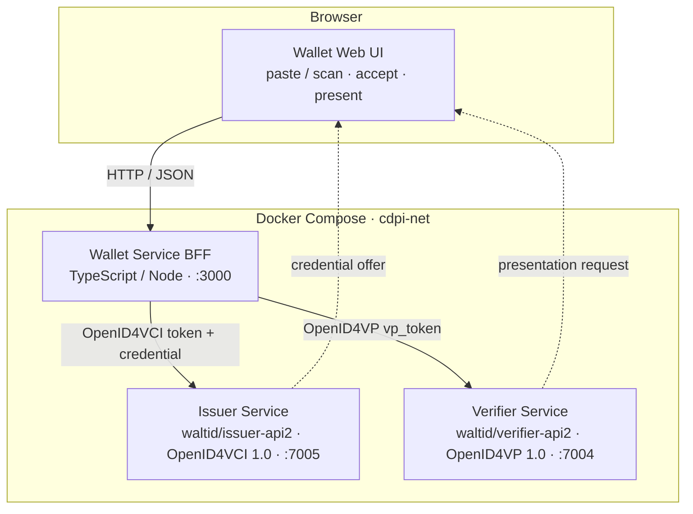
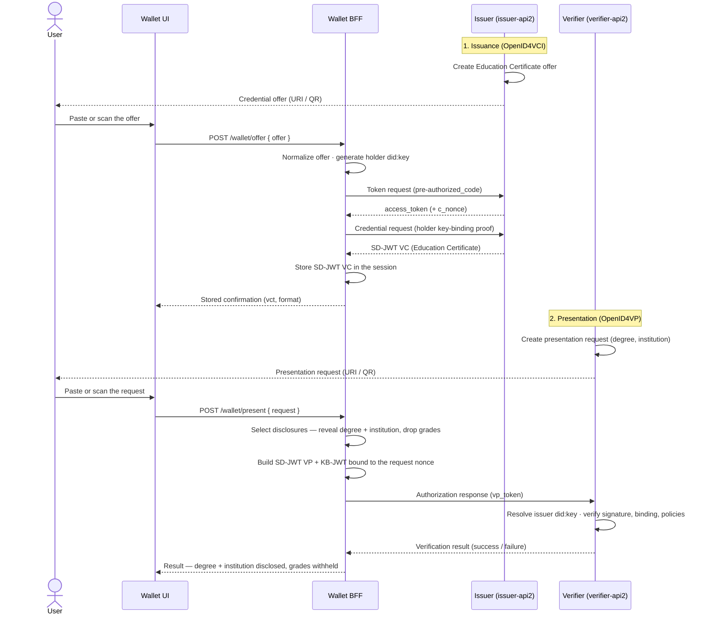

# walt.id Verifiable Credential — End-to-End Demo

A lean, runnable demonstration of the full **Verifiable Credential** lifecycle built on the
[walt.id Community Stack](https://docs.walt.id/community-stack/home). An **Issuer** mints an
**Education Certificate** as an **SD-JWT VC** over **OpenID4VCI**, a minimal web **Wallet**
(Holder) accepts and stores it, and the Wallet then produces a **selective-disclosure**
presentation over **OpenID4VP** that a **Verifier** validates — revealing the holder's `degree`
and `institution` while **withholding** `grades`.

The demo exercises the W3C VC Data Model, SD-JWT VC, **OpenID4VCI 1.0** and **OpenID4VP 1.0**,
with `did:key` / JWK keys. The Issuer and Verifier are pre-built, version-pinned walt.id
community images consumed over REST; the only bespoke service is the Wallet. The entire stack
starts with a single `docker compose up`.

> **Scope.** This is a happy-path demonstration, not a production wallet. It prioritizes a working
> end-to-end flow over exhaustive error handling, broad credential catalogs, or persistence.

---

## Table of contents

- [Architecture](#architecture)
- [End-to-end flow](#end-to-end-flow)
- [Prerequisites](#prerequisites)
- [Run the demo locally](#run-the-demo-locally)
- [Walk through the flow (Wallet UI)](#walk-through-the-flow-wallet-ui)
- [Test the project](#test-the-project)
- [Repository layout](#repository-layout)
- [Configuration reference](#configuration-reference)
- [Troubleshooting](#troubleshooting)
- [Known assumptions and caveats](#known-assumptions-and-caveats)

---

## Architecture

Three services orchestrated by Docker Compose on the shared `cdpi-net` bridge network. The browser
talks only to the Wallet BFF; the Wallet BFF is the only component that talks to both walt.id
services.

| Role | Service | Image / build | Host port | Protocol surface |
| :--- | :--- | :--- | :--- | :--- |
| Issuer | `services/issuer` | `waltid/issuer-api2:1.1.1` (JVM) | `7005` | OpenID4VCI 1.0 (SD-JWT VC issuance) |
| Verifier | `services/verifier` | `waltid/verifier-api2:1.1.1` (JVM) | `7004` | OpenID4VP 1.0 (presentation + policy validation) |
| Holder / Wallet | `services/wallet` | custom TS/Node BFF + static web UI | `3000` | OpenID4VCI client + OpenID4VP client |



The Issuer and Verifier are **configuration-only** (credential profile, presentation request,
policies — no application source); all bespoke code lives in `services/wallet`. On the Compose
network the Wallet reaches the other services at `http://issuer:7005` and `http://verifier:7004`
(injected as `ISSUER_BASE_URL` / `VERIFIER_BASE_URL`).

---

## End-to-end flow

The full journey is **issue → store → present → verify**, with selective disclosure applied at the
presentation step.



**Stages**

1. **Issuance.** The Issuer exposes a single `EducationCertificate` profile (SD-JWT VC, format
   `dc+sd-jwt`, claims `name` / `degree` / `institution` / `grades`, signed with a demo Ed25519
   `did:key`). An offer is created and handed to the Wallet. The Wallet runs the OpenID4VCI
   pre-authorized code flow (token → credential request with a holder `did:key` proof) and receives
   the SD-JWT VC.
2. **Storage.** The Wallet BFF stores the raw SD-JWT VC in server-side, session-scoped state and
   returns a confirmation to the UI.
3. **Presentation.** The Verifier creates an OpenID4VP request naming `degree` and `institution`.
   The Wallet selects those disclosures (dropping `grades`), builds an SD-JWT VP with a key-binding
   JWT bound to the request `nonce`, and posts the `vp_token`.
4. **Verification.** The Verifier resolves the issuer `did:key`, validates the signature, holder
   binding, disclosure integrity, nonce, and audience, confirms the disclosed claims, and returns a
   result.

---

## Prerequisites

- **Docker** and **Docker Compose v2** (`docker compose`, with a space — not the legacy
  `docker-compose` binary). Check with `docker compose version`.
- **Node.js >= 20.9.0** — only needed to run the test suites or the Wallet locally outside Docker.
  The Compose stack itself needs only Docker.
- Roughly **2.5 GB** of free memory for the stack (the two JVM services are capped at `1g` each;
  the Node wallet at `512m`).

---

## Run the demo locally

From the repository root:

```bash
docker compose up --build
```

This builds the Wallet image, pulls the pinned walt.id images, and starts all three services. The
Wallet only starts once the Issuer and Verifier report **healthy** (their health checks poll
`/swagger`).

Then open:

| URL | What it is |
| :--- | :--- |
| <http://localhost:3000> | **Wallet web UI** (the demo front end) |
| <http://localhost:7005/swagger> | Issuer API explorer (create credential offers) |
| <http://localhost:7004/swagger> | Verifier API explorer (create verification sessions) |

Stop with `Ctrl+C`, then `docker compose down` to remove the containers.

---

## Walk through the flow (Wallet UI)

The Wallet UI at <http://localhost:3000> has two sections: **Hold a credential** and
**Present a credential**.

### 1. Create a credential offer

Create an Education Certificate offer on the Issuer — via the Swagger UI at
<http://localhost:7005/swagger> or with curl:

```bash
# Expected shape — confirm the exact path in the issuer Swagger UI.
curl -X POST http://localhost:7005/openid4vci/offer \
  -H "Content-Type: application/json" \
  -d '{ "credentialConfigurationId": "EducationCertificate" }'
```

The response is an `openid-credential-offer://...` string.

### 2. Accept and store it

In **Hold a credential**, paste the offer (or scan its QR), then click **Accept offer**. The Wallet
runs OpenID4VCI, stores the SD-JWT VC for the session, and shows a confirmation with the credential
`vct` (`EducationCertificate`) and format (`sd-jwt-vc`). An invalid offer shows an error and leaves
any stored credential unchanged.

### 3. Create a verification session

Start a session on the Verifier — via <http://localhost:7004/swagger> or with curl, using the
request body shipped in the repo (requests only `degree` + `institution`):

```bash
# Expected shape — confirm the exact path in the verifier Swagger UI.
curl -X POST http://localhost:7004/verification-session/create \
  -H "Content-Type: application/json" \
  -d @services/verifier/config/presentation-request.json
```

The response contains an authorization-request URL (and a `nonce`).

### 4. Present and verify

In **Present a credential**, paste (or scan) the authorization-request string, then click
**Present**. The Wallet reveals `degree` + `institution`, binds the presentation to the request
`nonce`, and submits it. The result panel shows:

- **`degree` and `institution` disclosed** — present and verified, and
- **`grades` withheld** — never left the Wallet.

---

## Test the project

There are three test layers. The first two need no running stack; the integration test needs the
Compose stack up.

### Wallet unit + property tests (no stack required)

```bash
cd services/wallet
npm install          # first run also generates package-lock.json — commit it
npm run build        # compile TypeScript (tsc --build)
npm run lint         # eslint
npm test             # vitest run — unit + property tests
```

The property tests use [fast-check](https://fast-check.dev) (100 iterations each) and encode the
design's correctness properties:

| Property | What it guarantees | Module under test |
| :--- | :--- | :--- |
| Property 1 | Education Certificate carries all four attributes | `oid4vciClient` |
| Property 2 | Credential storage round-trips unchanged | `sessionStore` |
| Property 3 | Reveal `degree` + `institution`, withhold `grades` | `disclosureSelector` |
| Property 4 | Paste and scan intake are equivalent | `offerIntake` |
| Property 5 | Unparseable offers are rejected | `offerIntake` |
| Property 6 | Presentation binds to the request challenge (nonce) | `oid4vpClient` |

Plus unit tests for the unsupported-credential-type error, the failed-signature relay, and the
Wallet BFF HTTP handlers.

### Compose config smoke test (no stack required)

A dependency-free static check of `docker-compose.yml` (service presence, pinned image tags, memory
limits, port mappings). It runs as part of the root test command below.

### Happy-path integration test (stack required)

Drives the full issue → store → present → verify flow against the **running** stack over REST and
asserts `success: true` with `degree` + `institution` disclosed and `grades` absent.

```bash
# Terminal 1 — bring the stack up and leave it running
docker compose up --build

# Terminal 2 — from the repo root, run against the live stack
npm install
npm run test:integration
```

> If the Verifier's authorization-request URL points at the in-network host (`verifier:7004`)
> rather than `localhost:7004`, see the [networking caveat](#known-assumptions-and-caveats). The
> integration driver best-effort rewrites that host for you.

---

## Repository layout

```text
cdpi-demo-vc-jcg/
├── docker-compose.yml          # three services: issuer, verifier, wallet (pinned, mem-limited)
├── README.md                   # this file
├── package.json                # root — runs the integration + compose smoke tests
├── vitest.config.ts            # root vitest config (tests/**)
├── docs/
│   └── adr/                    # architecture decision records (stack selection)
├── services/
│   ├── issuer/                 # config only — Education Certificate profile + demo did:key
│   │   └── config/
│   ├── verifier/               # config only — DCQL presentation request + validation policies
│   │   └── config/
│   └── wallet/                 # custom TS/Node BFF + static web UI (the Holder)
│       ├── src/                # offerIntake, oid4vciClient, holderKeys, sessionStore,
│       │                       #   disclosureSelector, oid4vpClient, httpApi, server
│       ├── public/             # thin web UI (index.html, app.js, styles.css)
│       ├── tests/              # unit + property tests
│       └── Dockerfile
└── tests/
    ├── compose/                # docker-compose static smoke test
    └── integration/            # happy-path full-flow driver (Vitest)
```

---

## Configuration reference

| Path | Mounted into container | Contents |
| :--- | :--- | :--- |
| `services/issuer/config/` | `/waltid-issuer-api2/config` (ro) | `credential-issuer-metadata.conf` (the `EducationCertificate` configuration) and `issuer2-profiles.conf` (profile: demo `did:key`, four-attribute claim template, selective-disclosure settings). |
| `services/verifier/config/` | `/waltid-verifier-api2/config` (ro) | `verifier-service.conf` (verifier `clientId`, `urlPrefix`, default policies) and `presentation-request.json` (the DCQL request for `degree` + `institution`). |

Wallet environment variables (set in `docker-compose.yml`):

| Variable | Compose value | Purpose |
| :--- | :--- | :--- |
| `ISSUER_BASE_URL` | `http://issuer:7005` | Issuer base URL (OpenID4VCI token + credential endpoints). |
| `VERIFIER_BASE_URL` | `http://verifier:7004` | Verifier base URL (OpenID4VP response submission). |
| `PORT` | `3000` (default) | Wallet listen port (local-run override). |

> **Issuer/Verifier config is read at startup.** After editing any `.conf` / `.json` under
> `services/*/config`, restart the affected service: `docker compose restart issuer` (or
> `verifier`).

### Wallet BFF endpoints

| Method & path | Purpose |
| :--- | :--- |
| `POST /wallet/offer` | Accept an offer string, run OpenID4VCI, store the credential, return a confirmation. |
| `GET /wallet/credential` | Return a redacted summary of the stored credential (never the raw SD-JWT). |
| `POST /wallet/present` | Apply selective disclosure, submit the `vp_token`, return the verification result. |
| `GET /healthz` | Liveness for the Docker/Compose health check. |

---

## Troubleshooting

- **Services never become healthy.** The JVM services take time to boot; the health check retries
  for ~2 minutes. Inspect logs: `docker compose logs issuer` / `docker compose logs verifier`. A
  container that keeps restarting is usually hitting its memory limit or failing to parse mounted
  config.
- **Port already in use** (`3000` / `7004` / `7005`). Stop the conflicting process, or remap the
  host side in `docker-compose.yml` (e.g. `"8005:7005"`) and adjust the URLs you use.
- **Config change not taking effect.** Restart the service — config is read at startup.
- **Container OOM-killed.** The JVM services are capped at `1g`; raise `mem_limit` (ADR band is
  512 MB–1 GB) or free host memory.
- **QR scan doesn't work.** Camera access needs a secure context and permission. Use the **paste**
  box instead — paste and scan go through the same normalization path.
- **Integration test can't connect.** Ensure `docker compose up` is running and all services are
  healthy before launching the test.

---

## Known assumptions and caveats

- **Dependency lockfile.** `services/wallet` does not yet commit a `package-lock.json`. Run
  `npm install` in `services/wallet` once to generate it and commit the result — this makes installs
  reproducible and lets CI and the Docker build use `npm ci` (which requires a lockfile). Until
  then, the Dockerfile and CI fall back to `npm install`.
- **walt.id endpoint paths.** The offer-creation (`POST /openid4vci/offer`) and
  verification-session (`POST /verification-session/create`) paths used in the docs and the
  integration driver match the service READMEs but should be confirmed against each running image's
  Swagger UI (`/swagger`).
- **Host-vs-Compose networking.** The Verifier builds its authorization-request URI from `urlPrefix`,
  which defaults to the in-network `http://verifier:7004/...`. That hostname only resolves inside the
  Compose network. When driving from the host, set `VERIFIER_URL_PREFIX` (or a per-session
  `url_config.url_prefix`) to a host-reachable base such as `http://localhost:7004/verification-session`.
  The integration driver best-effort rewrites `verifier:7004` → `localhost:7004`.
- **Stack version.** The ADR names the walt.id `issuer-api`/`verifier-api` services; this demo targets
  the current community **v2** images (`issuer-api2`/`verifier-api2`) because they implement the
  finalized OpenID4VCI 1.0 / OpenID4VP 1.0 specifications. See
  [docs/adr/0001-waltid-stack-selection.md](docs/adr/0001-waltid-stack-selection.md).

---

## About the walt.id services

The Issuer and Verifier are the pinned walt.id community images **`waltid/issuer-api2`** and
**`waltid/verifier-api2`** (`1.1.1`), implementing the finalized **OpenID4VCI 1.0** and
**OpenID4VP 1.0** specifications. They are consumed over REST and never modified — only their mounted
config is part of this repo. The Wallet is the only custom service. References:
[Issuer2](https://docs.walt.id/community-stack/issuer2/getting-started),
[Verifier2](https://docs.walt.id/community-stack/verifier2/getting-started).
_Content was rephrased for compliance with licensing restrictions._
